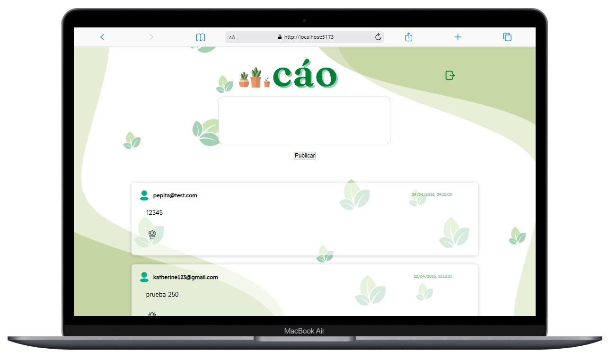

# Red Social - Cáo
## Resumen del proyecto
Bienvenidos a CAO, una red social para amantes de las plantas, donde podrás crear una cuenta personalizada y acceder a ella de manera fácil y rápida. En CAO podrás publicar información y disfrutar de la interacción con otros seguidores de plantas en línea, activar like a sus publicaciones y recibir likes en las tuyas.

Hemos desarrollado esta red social utilizando una aplicación de página única (SPA) con múltiples vistas o páginas, lo que asegura una experiencia de usuario fluida y satisfactoria. Además, hemos integrado Firebase como backend y Vite como herramienta de compilación para garantizar un rendimiento rápido y confiable.

En CAO, estamos comprometidos a fomentar la comunidad de amantes de las plantas y proporcionar una plataforma para la interacción y el intercambio de información. ¡Únete a nuestra comunidad y comparte tus conocimientos sobre tus plantas favoritas!
## Historias de usuario
Para el desarrollo de Cáo, se hizo una previa investigación basándose en historias de usuario.

Historias de usuario - Cáo

<ul>
<li> HU1 : Yo como aficionada de las  plantas quiero poder crear una cuenta en la app Cáo.</li>
<li> HU2 : Yo como aficionada de las  plantas quiero poder iniciar sesión con mi cuenta ya creada en la app. </li>
<li> HU3 : Yo como aficionada de las  plantas quiero poder iniciar sesión con mi cuenta de google. </li>
<li> HU4 : Yo como aficionada de las  plantas quiero poder escribir textos, publicarlos y visualizarlos en la pantalla principal de la app.</li>
<li> HU5 : Yo como aficionada de las  plantas quiero poder editar mi publicación, según sea necesario.</li>
<li>HU6 : Yo como aficionada de las  plantas quiero poder eliminar publicaciónes que realicé, según sea necesario.</li>
<li>HU7 : Yo como aficionada de las  plantas quiero poder Interactuar mediante likes con otras publicaciones
para demostrar si me gusta o no una publicación (Este comportamiento de interfaz se implementará posteriormente).</li>
<li>HU8 : Yo como aficionada de las  plantas quiero poder eliminar los likes  que le dí a otras publicaciones, para 
para demostrar que ya no me gusta determinada publicación (Este comportamiento de interfaz se implementará posteriormente)</li>
</ul>

## Protótipo de alta fidelidad
 Para crear el prototipo de alta fidelidad de Cáo en Figma, primero identificamos las diferentes secciones y funcionalidades de la aplicación, como la pantalla de inicio de sesión y la sección de las publicaciones.

## Diseño responsive
Para garantizar la accesibilidad de nuestra página web en dispositivos móviles, aplicamos la metodología "Mobile First" en el proceso de diseño. Siguiendo este enfoque, nos aseguramos de que la página sea fácilmente navegable en pantallas más pequeñas y que los elementos importantes estén ubicados en posiciones adecuadas. Una vez finalizado el diseño móvil, ampliamos la presentación a tamaño de pantalla más grande y ajustamos el diseño según sea necesario para asegurar una adaptabilidad total de la página en otas las plataformas.

## Comportamiento de la interfaz de usuario (UI)
**Creación de cuenta de usuario e inicio de sesión**
* _Login_ con Firebase:
   - Creación de cuenta de acceso y autenticación con cuenta de correo y
    contraseña, y también con una cuenta de Google.
* Validaciones:
  - Solamente se permite el acceso a usuarios con cuentas válidas.
  - No pueden haber usuarios repetidos.
  - La cuenta de usuario debe ser un correo electrónico válido.
  - Lo que se escriba en el campo (_input_) de contraseña debe ser secreto.
* Comportamiento:
  - Al enviarse el formulario de registro o inicio de sesión, debe validarse.
  - Si hay errores, se deben mostrar mensajes descriptivos para ayudar al
  usuario a corregirlos.

**Muro/timeline**
* Comportamiento:
  - Al recargar la aplicación, se debe verificar si el usuario está _logueado_
    antes de mostrar contenido.
  - Poder publicar un _post_.
  - A futuro se implementará el poder dar y quitar _like_ a una publicación. Máximo uno por usuario.
  - A futuro se implementará llevar un conteo de los _likes_.
  - Poder eliminar un post específico.
  - Pedir confirmación antes de eliminar un _post_.
  - Al dar _click_ para editar un _post_, debe cambiar el texto por un _input_
    que permita editar el texto y luego guardar los cambios.
  - Al guardar los cambios debe cambiar de vuelta a un texto normal pero con la
    información editada.
  - Al recargar la página debo de poder ver los textos editados.
## Objetivos generales del proyecto son los siguientes:
* Desarrollar una SPA con la temática de red socia.l
* Aplicar los conceptos de responsividad en el desarrollo de las vistas (templates)
* Implementar un router para la navegación entre las diferentes vistas de la aplicación.
* Emplear un servicio externo para la persistencia de datos de la aplicación.
* Crear una suite de pruebas unitarias que permitan testear código asíncrono.
## Objetivos de aprendizaje
Para lograr estos objetivos mencionados anteriormente, se hizo uso de las siguientes herramientas o habilidades técnicas:
### HTML

- **Uso de HTML semántico**
### CSS

- **Uso de selectores de CSS**
- **Modelo de caja (box model): borde, margen, padding**
- **Uso de flexbox en CSS**
### Web APIs

- **Uso de selectores del DOM**
- **Manejo de eventos del DOM (listeners, propagación, delegación)**
- **Manipulación dinámica del DOM**
- **Ruteado (History API, evento hashchange, window.location)**
### JavaScript

- **Arrays (arreglos)**
- **Objetos (key, value)**
- **Diferenciar entre tipos de datos primitivos y no primitivos**
- **Variables (declaración, asignación, ámbito)**
- **Uso de condicionales (if-else, switch, operador ternario, lógica booleana)**
- **Uso de bucles/ciclos (while, for, for..of)**
- **Funciones (params, args, return)**
- **Pruebas unitarias (unit tests)**
- **Pruebas asíncronas**
- **Uso de mocks y espías**
- **Módulos de ECMAScript (ES Modules)**
- **Uso de linter (ESLINT)**
- **Uso de identificadores descriptivos (Nomenclatura y Semántica)**
- **Diferenciar entre expresiones (expressions) y sentencias (statements)**
- **Callbacks**
- **Promesas**
### Control de Versiones (Git y GitHub)
- **Git: Instalación y configuración**
- **Git: Control de versiones con git (init, clone, add, commit, status, push, pull, remote)**
- **Git: Integración de cambios entre ramas (branch, checkout, fetch, merge, reset, rebase, tag)**
- **GitHub: Creación de cuenta y repos, configuración de llaves SSH**
- **GitHub: Despliegue con GitHub Pages**
- **GitHub: Colaboración en Github (branches | forks | pull requests | code review | tags)**
### Centrado en el usuario
- **Diseñar y desarrollar un producto o servicio poniendo a las usuarias en el centro**
### Diseño de producto
- **Crear prototipos de alta fidelidad que incluyan interacciones**
- **Seguir los principios básicos de diseño visual**
### Investigación
- **Planear y ejecutar testeos de usabilidad de prototipos en distintos niveles de fidelidad**
### Firebase
- **Firebase Auth**
- **Firestore**

